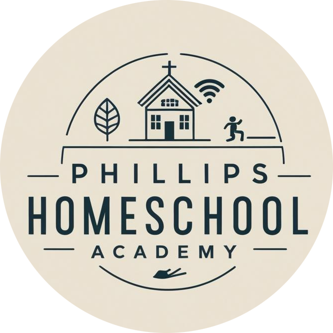

# Phillips Academy Task Manager

<div align="center">
  
</div>

## About

Phillips Academy Task Manager is a specialized task management application designed for homeschool children. It provides an intuitive interface for managing daily and weekly tasks, with separate views for both parents and children.

## Features

- 📱 Progressive Web App (PWA) support for mobile installation
- 👨‍👩‍👧‍👦 Separate parent and child interfaces
- 📅 Daily and weekly task views
- ✅ Task completion tracking
- 🔄 Sorting functionality for tasks and skills
- 🎨 Modern, clean interface with Tailwind CSS

## Usage

### For Parents
1. Access the parent view to manage and oversee tasks
2. Create and assign tasks for your children
3. Monitor task completion and progress
4. View both list and weekly calendar views
5. Sort tasks by name, points, or type for better organization

### For Children
1. Access your personal dashboard
2. View assigned tasks for the day or week
3. Mark tasks as complete
4. Track your progress through different view options
5. Sort tasks by name, points, type, or completion status

## Developer Setup

### Prerequisites
- Node.js (Latest LTS version recommended)
- npm or yarn

### Installation

1. Clone the repository:
```bash
git clone https://github.com/yourusername/phillips-academy.git
cd phillips-academy
```

2. Install dependencies:
```bash
npm install
```

3. Start the development server:
```bash
npm run dev
```

4. Build for production:
```bash
npm run build
```

5. Preview production build:
```bash
npm run preview
```

### Tech Stack
- React
- TypeScript
- Vite
- Tailwind CSS
- PWA (Progressive Web App)

## License

MIT
